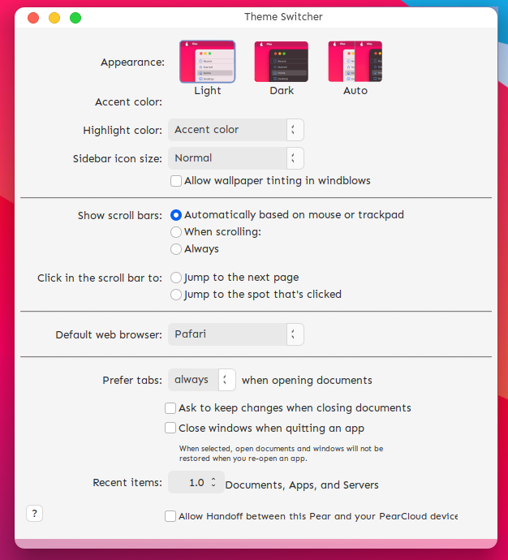

# Theme Switcher app for pearOS
This app is made to allow easy Lightmode- darkmode themes switching by the end-user, in pearOS ThiccSur.

## Screenshots :)



## Dependencies

   - install gambas3 package
   ```sh
   $ sudo apt-get install gambas3 -y
   ```

## Installation steps
 - From Source:

   - clone the project
   ```sh
   git clone https://github.com/alxb421/theme-switcher.git
   ```
   - Open gambas3 application (from terminal `$ gambas3`, or from application dashboard, search for gambas3)
   - Click `Open`
   - Navigate to cloned folder, and open the project
   - Click on `Project` > `Make` > `executable`
   - copy the new executable in the `/usr/bin` folder of your Linux machine
   ```sh
   $ sudo mv <path to your generated .gambas file> /usr/bin/themesw
   ```
   - Enjoy :p

 - From Package:
   - Download the .deb package from `Releases` tab here, in GitHub
   - Install using gdebi/ dpkg
   ```sh
   $ sudo dpkg -i <path to downloaded deb file, or drag and drop>
   ```
   
   ## Usage
   - From Terminal:
     - Open a terminal and type `themesw`
   - From Application Daskboard:
     - Search for Theme Switcher with the nice icon made by Andrei Muntean. All rights reserved to him.
